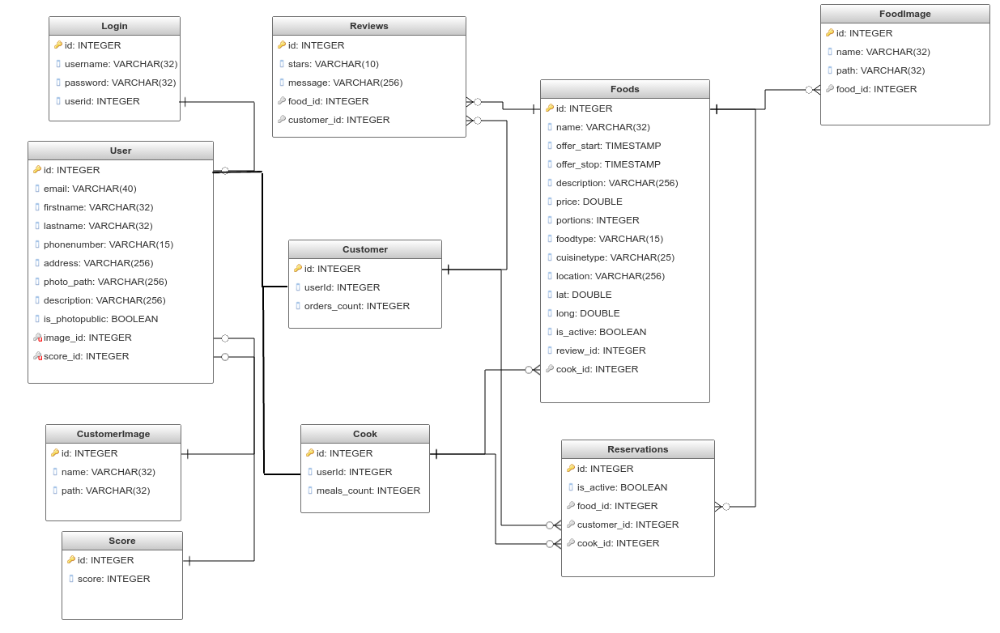

# PalsPlate Backend 

## Technology Stack:

* Java 8: primary language
* Maven 3: package manager
* Spring Boot 1.1.9.RELEASE: smart stand-alone application builder
* Jersey 2.7: RESTful Webservices package
* Hibernate 4: ORM (object relations mapper) framework. Mapps java objects to tables in SQL database
* PostgreSQL: Main Production Database


- - - -
### @Annotations

We implemented Jersey with Spring for REST support using JAX-RS API. Although, Spring has pretty good REST support.

Hence you will see difference in Annotations like @PATH being used rather than @RequestMapping

- - - -
## Populate Database:

Populate palsplate-demo database with some dummy data.

Use the following queries: 

```
INSERT INTO PERSON VALUES (1, 'asfandyar@gmail.com', 'Asfandyar', 'Malik', 'mypass', 'ROLE_USER,ROLE_ADMIN', '01575117434', 'islamabad', 'best chef ever', true)

INSERT INTO Customer VALUES (1, 1)

INSERT INTO Cook VALUES (1, 2)
INSERT INTO Cook VALUES (2, 3)

INSERT INTO FOOD VALUES(1, 'Biryani', '2011-05-16 15:36:38', '2011-06-16 15:36:38', 'Indian delight', 5, 3, 'vegetarian', 'Indian', 0.45, 0.56, true, 1)
INSERT INTO FOOD VALUES(2, 'Omlette', '2011-05-16 15:36:38', '2011-06-16 15:36:38', 'French delight', 5, 3, 'vegetarian', 'French', 0.45, 0.56, true, 1)
INSERT INTO FOOD VALUES(3, 'burger', '2011-05-16 15:36:38', '2011-06-16 15:36:38', 'fast food delight', 5, 3, 'meat', 'fast_food', 0.45, 0.56, true, 2)
```

- - - -
## QUERY DATABASE

Following is a query which finds out all persons/users who are cooks and currently have food offerings

```
select * 
from cook c
inner join person p on c.person_id = p.id
inner join food f on c.id = f.cook_id
where f.is_active = 't'
limit 10;
```

- - - -
## ENVIRONMENT VARIABLES

The code only uses the following environment variables.
PALSPLATE_DB_URL

This value is equal to the db url from Heroku. 
(Remember that Heroku url is different from posgres url)

Heroku Postgres url: `postgres://<username>:<password>@<host>:<port>/<dbname>`

Java Posgres url: `jdbc:postgresql://<host>:<port>/<dbname>?user=<username>&password=<password>`


- - - -
## Run Complete System

```
mvn clean package && mvn spring-boot:run
```
```
mvn clean package && java -jar target/palsplate-backend-1.0-SNAPSHOT.jar
```

Go to: `localhost:8080/api/secure/products`


- - - -
### Security and Authorization

Authorization is provided by via spring security using the **oauth2.0** protocol. By design all the resources matching ``/api/secure/*`` are secured and require a login to retrieve.

There are 5 different grants to get access_token in oauth2, and in this project, `resource owner credentials grant` is being used. 

The authorization protocol follows the following mechanism.

1. Provide the username and password to retrieve the refresh token

`curl -u webclient:secret 'http://localhost:8080/oauth/token?username=admin&password=admin&grant_type=password'`

````{"access_token":"8789eae9-0863-4266-bff0-79e7799c910f","token_type":"bearer","refresh_token":"73f29da8-57c5-4ae3-ac4d-59a061d6c05b","expires_in":1799,"scope":"read write"}````


2. Use the access token to retrieve the desired resource

 `curl -i -H "Authorization: Bearer <access-token>" http://localhost:8080/api/secure/persons `


3. Provide the refresh token to the server to again retrieve the access token, if it gets expired

`curl -u webclient:secret 'http://localhost:8080/oauth/token?grant_type=refresh_token&refresh_token=<refresh-token>'  `

where <refresh-token> is received in the previous command

 ````{"access_token":"ef981a33-b431-44a9-86f3-ce4df31c6d5f","token_type":"bearer","refresh_token":"73f29da8-57c5-4ae3-ac4d-59a061d6c05b","expires_in":1799,"scope":"read write"} ````

4. InOrder to receive currentUser information from token, use the following API:

 `GET http://localhost/api/secure/persons/currentuser`


- - - -
## REST REQUEST

Following is a list of some examples of rest requests one can use:

```
GET: http://localhost:8080/api/public/cooks
GET: http://localhost:8080/api/public/cooks/1
GET: http://localhost:8080/api/public/foods
GET: http://localhost:8080/api/public/cooks/1/foods
GET: http://localhost:8080/api/secure/customers/1
```

### Person

 * Get one specific record
 ``GET http://localhost:8080/api/secure/persons/{id}``
 * Update a specific record
 ``PUT http://localhost:8080/api/secure/persons/{id}``
 * Delete a specific record
 ``DELETE http://localhost:8080/api/secure/persons/{id}``
 * Create a new record with following payload

`curl -X POST -d @curlJson.txt -H "Authorization: Bearer <access-token>" http://localhost:8080/api/secure/persons --header "Content-Type:application/json"`


where curlJson.txt contains:
```
{
"email": "wishere@gmail.com",
"firstName": "Jack",
"lastName": "wishere",
"password": "mypass",
"granted_role": "ROLE_USER,ROLE_ADMIN",
"phoneNumber": "+157511743434",
"description": "foodie",
"isPhotoPublic": "true"
}

```

 * Post a picture for one specific record
`curl -H "Authorization: Bearer <access-token>" -F "file=@asfandz.jpg" http://localhost:8080/api/public/persons/1/photo`


### Cook

 * Get one specific record
 ``GET http://localhost:8080/api/public/cooks/{id}``
 * Update a specific record
 ``PUT http://localhost:8080/api/public/cooks/{id}``
 * Delete a specific record
 ``DELETE http://localhost:8080/api/public/cooks/{id}``
 * Get photo of a cook
  ``GET http://localhost:8080/api/public/cooks/{id}/photo``
 * Create a new record with a curl example


`curl -X POST -d @curlJsonCook.txt -H "Authorization: Bearer <access-token>" http://localhost:8080/cooks --header "Content-Type:application/json"`

where curlJsonCook.txt contains:
```
{
  "person_id": 7
}
```

### Customers

 * Get one specific record
 ``GET http://localhost:8080/api/secure/customers/{id}``
 * Update a specific record
 ``PUT http://localhost:8080/api/secure/customers/{id}``
 * Delete a specific record
 ``DELETE http://localhost:8080/api/secure/customers/{id}``
 * Get photo of a customer
 ``GET http://localhost:8080/api/secure/customers/{id}/photo``
 * Get all reservations of a customer
 ``GET http://localhost:8080/api/secure/customers/{id}/reservations ``
 * Create a new record with a curl example

`curl -X POST -d @curlJsonCustomer.txt -H "Authorization: Bearer <access-token>" http://localhost:8080/api/secure/customers --header "Content-Type:application/json"`

where curlJsonCustomer.txt contains:
```
{
  "person_id": 7
}
```

### Foods

 * Get one specific record
 ``GET http://localhost:8080/api/public/foods/{id}``
 * Get all foods for a specific cook
 ``GET http://localhost:8080/api/public/cooks/{id}/foods``
 * Update a specific record
 ``PUT http://localhost:8080/api/public/foods/{id}``
 * Delete a specific record
 ``DELETE http://localhost:8080/api/public/foods/{id}``
 * Create a new record with a curl example

 `curl -X POST -d @curlJsonFood.txt -H "Authorization: Bearer <access-token>" http://localhost:8080/api/public/foods --header "Content-Type:application/json"`


 ````
 {
 "name": "Veggie special",
 "offer_start": 1305552998000,
 "offer_stop": 1308231398000,
 "description": "vegetarian delight",
 "price": 5,
 "portion": 2,
 "food_type": "veggie",
 "cuisine_type": "fast_food",
 "lat": 0.45,
 "lon": 0.56,
 "is_active": true,
 "cook_id": 3
 }
 ````

* Get all foods for a specific cook
`` GET http://localhost:8080/api/secure/cooks/1/foods


### Images

 * Get one specific record
 ``GET http://localhost:8080/api/secure/images/{id}``
 * Get all images for a specific food
 ``GET http://localhost:8080/api/public/foods/{id}/images``
 * Update a specific record
 ``PUT http://localhost:8080/api/secure/images/{id}``
 * Delete a specific record
 ``DELETE http://localhost:8080/api/secure/images/{id}`` 
 * Create new record
 ``POST http://localhost:8080/api/public/foods/{id}/images``

Curl POST example of creating an image 
`curl -H "Authorization: Bearer <access-token>" -F "file=@biryani.jpg" http://localhost:8080/api/secure/public/{food_id}/images`

Curl GET example to get images for a specific food
`curl -i -H "Authorization: Bearer <access-token>" http://localhost:8080/api/public/foods/2/images`

### Reviews

 * Get one specific record
 ``GET http://localhost:8080/api/public/reviews/{id}``
 * Get all reviews for a specific food
 ``GET http://localhost:8080/api/public/foods/{id}/reviews``
 * Update a specific record
 ``PUT http://localhost:8080/api/public/reviews/{id}``
 * Delete a specific record
 ``DELETE http://localhost:8080/api/public/reviews/{id}`` 
 * Create new record
 ``POST http://localhost:8080/api/public/foods/{id}/reviews``

Curl POST example of creating an review 
`curl -H "Authorization: Bearer <access-token>" http://localhost:8080/api/secure/reviews`

```
{
  "text": "bad food",
  "rating": 1,
  "food_id": 2,
  "customer_id":1
}
```

Curl GET example to get reviews for a specific food
`curl -i -H "Authorization: Bearer <access-token>" http://localhost:8080/api/secure/reviews`


### Reservation

 * Get one specific record
 ``GET http://localhost:8080/api/public/reservations/{id}``
 * Update a specific record
 ``PUT http://localhost:8080/api/secure/reservations/{id}``
 * Delete a specific record
 ``DELETE http://localhost:8080/api/secure/reservations/{id}``
 * Create a new record with a curl example


`curl -X POST -d @curlJsonReservation.json -H "Authorization: Bearer <access-token>" http://localhost:8080/api/secure/reservations --header "Content-Type:application/json"`

where curlJsonReservation.json contains:
```
{
  "is_active": true,
  "customer_id": 1,
  "food_id": 2
}
```

* Change activity status of certain reservation
 ``POST http://localhost:8080/api/secure/reservations/{id}?active={active}``
 where `id` is reservation id and `active` is boolean true or false

- - - -
### Location

 * Get location of a food
 ``GET localhost:8080/api/secure/foods/{id}/location_foods``

 * Get location of a person
 ``GET localhost:8080/api/public/persons/{id}/location_persons``

 * Post location of a person
  ``POST localhost:8080/api/public/location_persons`` 
  with following body: 
```
{
    "id": 2,
    "address": "st 16 rawalpindi pakistan 4600",
    "lat": 5.5,
    "lon": 4.56,
    "street": "st 16",
    "sublocality": "chaklala",
    "city": "rawalpindi",
    "country": "pakistan",
    "postal_code": "46000",
    "person_id": 27
}
```

- - - -
## Food Filtering API

 * Get all foods below provided price
 ``GET http://localhost:8080/api/public/foods?maxPrice={max}``

 * Get all foods of certain food type
 ``GET http://localhost:8080/api/public/foods?foodType={foodType}``

 * Get all foods of certain cuisine type
 ``GET http://localhost:8080/api/public/foods?cuisineType={cuisineType}``

 * Get all foods a certain distane away from customer
   In the following API. lng and lat are coordiates of current location of customer and maxDist is what customer inputted.
    Also note that maxDist should be in kilometers.

 ``GET http://localhost:8080/api/public/foods?maxDist={maxDist}&lon={lon}&lat={lat}``


 * Multiple filters can be added seperated by `&`. Keywords are (maxDist, lat, lon), cuisineType, foodType, maxPrice
 ``GET http://localhost:8080/api/public/foods?foodType={foodType}&maxPrice={maxPrice}``

   
   Tested Examples Curl:
   
   * `curl -i -H "Authorization: Bearer <access-token>" http://localhost:8080/api/public/foods?maxDist=20&lon=0.45&lat=0.56`
   * `curl -i -H "Authorization: Bearer <access-token>" http://localhost:8080/api/public/foods?cuisinetype=fast_food`
   * `curl -i -H "Authorization: Bearer <access-token>" http://localhost:8080/api/public/foods?foodtype=veggie`
   * `curl -i -H "Authorization: Bearer <access-token>" http://localhost:8080/api/public/foods?maxPrice=5`
   * `curl -i -H "Authorization: Bearer <access-token>" "http://localhost:8080/api/public/foods?foodType=vegetarian&maxPrice=4`
   

- - - -
## Email (with templates)

Send an Email to certain recipient with following post body

``POST localhost:8080/api/secure/emails``
```
{
  "subject": "Palsplate Test Bro 4",
  "recipientEmail": "malikasfandyarashraf@gmail.com",
  "type": "reservation_cook",
  "recipientName": "OGMalik", 
  "locale": "en",
  "token": "*****",
  "foodName": "Biryani",
  "foodPrice": "4.5",
  "foodOfferStart": "2015-4-10", 
  "foodOfferStop": "2017-4-10", 
  "reservation_id": 50,
  "person_id": 1
}

```

type can be following: 
  * signup_successful `(mandatory fields: person_id, recipientName)`
  * reservation_cook `(mandatory fields: recipientName, foodName, reservation_id)`
  * reservation_customer `(mandatory fields: foodName, foodPrice, recipientName, foodOfferStart, reservation_id)`
  * contact_us `(mandatory fields: body, from, subject)`

variables which can be used in html to make dynamic content are as follows: 

* recipient.name
* recipient.reservation_id
* recipient.person_id
* recipient.foodName
* recipient.foodPrice
* recipient.foodOfferStart
* recipient.foodOfferStop
* recipient.reservationUrl
* recipient.personUrl

variables in html are added in percentage signs: 
`%recipient.name%`

Note: for email type = `contact_us`, one has to specify the following parameters
* recipient.type
* recipient.subject
* recipient.token
* recipient.body
* recipient.from


```
{
  "type": "contact_us", 
  "subject": "information about food",
  "token": "******",
  "body": "I really love your food", 
  "from": "jojo@gmail.com"
}

```
Email from this API would be sent to inbox of `info@palsplate.com`
 - - -
 ## Customs API
 
  * Get reservation with cook and customer information
  
  ``GET localhost:8080/api/secure/reservations/{reservation_id}/getCustomerAndCook``

  * Get cook info with food object
    ``GET localhost:8080/api/public/foods/{food_id}/cookinfo``
    
  * Get all foods with cook info
   ``GET localhost:8080/api/public/customs/foodsWithCooks?size=3&sort=id``
 
```
{
    "company": "Palsplate",
    "foodsWithCooksJson": [
        {
            "cook_name": "HanooMalik",
            "food_average_rating": 4,
            "id": 41,
            "cook_photo": "cmn2bezmfza9iz8y6dcn",
            "cook_description": "I am cool"
        },
        {
            "cook_name": "SaadSaeed",
            "food_average_rating": null,
            "id": 50,
            "cook_photo": "dysyuzbdxf5vdxikkwiu",
            "cook_description": "Cooking enthusiast"
        }
    ]
}
```
  
  * Get all reviews with customer info
   ``GET localhost:8080/api/public/customs/reviewsWithCustomers``
     
``   
{
"company": "Palsplate",
"reviewsWithCustomers": [
   {
       "customer_photo_id": "dysyuzbdxf5vdxikkwiu",
       "id": 13,
       "customer_name": "SaadSaeed",
       "customer_id": 17
   },
   {
       "customer_photo_id": null,
       "id": 14,
       "customer_name": "s",
       "customer_id": 26
   }
]
}
   
``    

 
 - - - 
## Database Schema
   
   
   